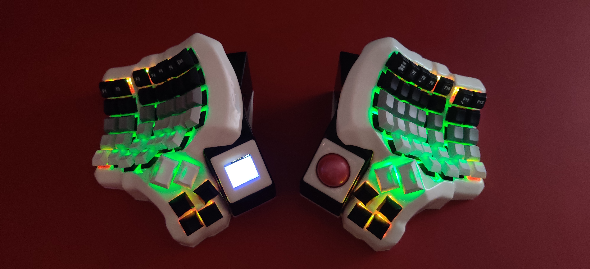

# Custom keyboard



This is my custom keyboard, using a set of 3 Raspberry PI Pico W. One for each node and another
serving as the usb dongle. The dongle also serves as a WiFi access point, to which the other
two nodes connect as WiFi clients.

The left node, includes the LCD display to enbale a basic UI for adjusting the settings.
The right node, includes the trackball for mouse inputs.
The settings are stored on a flash chip addd to the dongle unit.

Each node has separate LEDs under each key. I need to find good keycaps for best use of them,
though not a priority.

# Hardware components

## Dongle

- 1 x Raspberry PI Pico W
- 1 x 4 MB Flash (W25Q32) for storing settings
- 4 x 10 KΩ resistors (for flash pull ups)
- 2 x 5 KΩ resistors (for LED)
- 1 x pushbutton switch (reset button)
- 2 x LEDs (indicate connection status to left/right node)
- 1 x USB A male socket (convert the picow to dongle)

## Left Node

- 1 x Raspberry PI Pico W
- 42 x diodes
- 42 x key hotswap sockets
- 42 x WS2812 5mmx5mm leds for keys backlight
- 1 x 1.54" LCD 240x240 65K RGB by Waveshare
- 1 x RTC DS3231 (clock with own battery)
- 1 x pushbutton switch (reset button)
- 1 x LED (Numlock/connection status)
- 1 x 3.3V to 5V logic converter
- 10 x 10 KΩ resistors (pull ups)
- 1 x 500 Ω resistor (series resistor for the WS2812 led chain)
- 1 x 5 KΩ resistor (for LED indicator)
- 2 x 7x2 pin FRC female connector
- 1 x 14 pin FRC cable with both side 7x2 pin FRC male connector
- 8 bit header pins
- 1 x 3mmx7mm double sided perforated board
- 1 x 1000 µF capacitor for key backlight leds
- 1 x 470 µF capacitor on 3.3V output from Pico
- 1 x 2A 5V output BMS 1S and a 3.7V LiPo battery
- ample amount of magnet wire for the wiring

## Right Node

- 1 x Raspberry PI Pico W
- 42 x diodes
- 42 x key hotswap sockets
- 42 x WS2812 5mmx5mm leds for keys backlight
- 1 x PMW3389 motion sensor for track ball
- 1 x pushbutton switch (reset button)
- 1 x LED (Capslock/connection status)
- 1 x 3.3V to 5V logic converter
- 10 x 10 KΩ resistors (pull ups)
- 1 x 500 Ω resistor (series resistor for the WS2812 led chain)
- 1 x 5 KΩ resistor (for LED indicator)
- 2 x 7x2 pin FRC female connector
- 1 x 14 pin FRC cable with both side 7x2 pin FRC make connector
- 8 bit header pins
- 1 x 3mmx7mm double sided perforated board
- 1 x 1000 µF capacitor for key backlight leds
- 1 x 470 µF capacitor on 3.3V output from Pico
- 1 x 2A 5V output BMS 1S and a 3.7V LiPo battery
- ample amount of magnet wire for the wiring

# Dependency

## Install build tools (Archlinux)

```sh
sudo pacman -Syu base-devel cmake
sudo pacman -Sy arm-none-eabi-binutils arm-none-eabi-gcc arm-none-eabi-newlib
```

## PICO SDK & TinyUSB

Add the PICO SDK as git submodules. And update the lib/tinyusb git submodule within it.

```sh
git submodule add https://github.com/raspberrypi/pico-sdk pico-sdk
cd pico-sdk
git submodule update --init
```
# TODO

Need to update the wiring diagrams, which are still the old ones used for the two node wired version.
Since, now I am using the wireless mode, and removed a few redundant hardware components, the wiring
is much simpler now.
