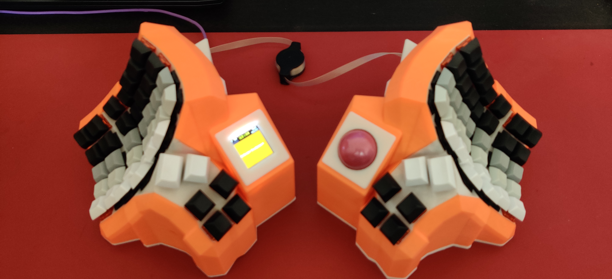
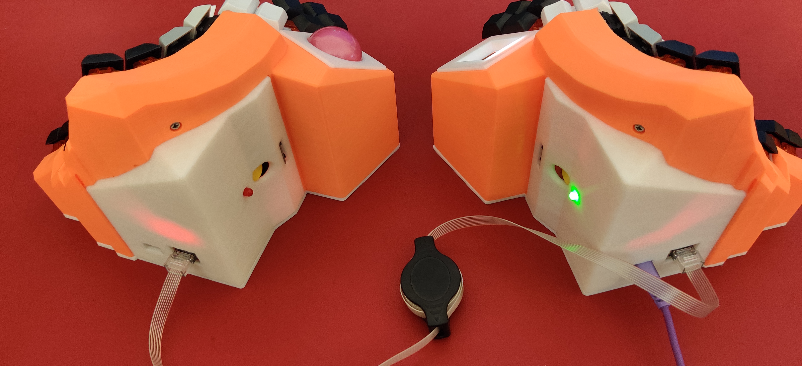

# Custom keyboard




# Dependency

## Install build tools (Archlinux)

```sh
sudo pacman -Syu base-devel cmake
sudo pacman -Sy arm-none-eabi-binutils arm-none-eabi-gcc arm-none-eabi-newlib
```

## PICO SDK & TinyUSB

Add the PICO SDK as git submodules. And update the lib/tinyusb git submodule within it.

```sh
git submodule add https://github.com/raspberrypi/pico-sdk pico-sdk
cd pico-sdk
git submodule update --init
```
